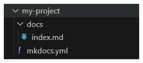

# 先看结论
访问http://wanyanan.gitlabpage.local/mkdocs_template/ （公司内网） 以查看效果
（外网） https://southofasia.github.io/PagesTest/

# Mkdocs Template

本项目为一个mkdocs模板，可以快速搭建一个基于mkdocs的文档网站。
建议的搭建方案还是将你要说的所有注意事项放入一个 `docs`文件夹，然后使用mkdocs将文档转换为html，这样可以更方便的管理文档。

## 安装

首先 运行下面的命令来安装

```
pip install mkdocs
```

## 创建新项目

1. 打开命令行，进入你要创建项目的目录
2. 输入命令 `mkdocs new my-project` 来创建一个名为 `my-project`的新项目
3. `cd my-project` 进入项目目录
4. 输入命令 `mkdocs serve` 来启动本地服务器，预览网站效果
5. 打开浏览器，访问 `http://127.0.0.1:8000/` 预览网站效果

其他的我也不想说了 直接去[https://www.mkdocs.org/](https://www.mkdocs.org/ "mkdocs教程")自己研究去吧

## 注意事项

**在研究过程中遇到了.pages未生效的情况，这边建议直接在mkdocs.yml里面编写目录结构**


简单来说 gitlab ci/cd就是把你的脚本放在一个叫做runner的服务器上面去跑，`.gitlab-ci.yml`这个文件很好去解析


```yaml
image: swr.cn-north-4.myhuaweicloud.com/ddn-k8s/docker.io/python:3.9.19

pages:
  script:
    - pip install -i https://mirrors.ustc.edu.cn/pypi/web/simple mkdocs mkdocs-material mkdocs-awesome-pages-plugin mkdocs-pdf-export-plugin mkdocs-glightbox mkdocs-git-revision-date-plugin
    - mkdocs build
    - mv site public
  artifacts:
    paths:
    - public

job:
  script: echo "This job runs only on main branch or tags"
  rules:
    - if: '$CI_COMMIT_BRANCH == "main"'       # 仅 main 分支触发
    - if: '$CI_COMMIT_TAG'                    # 打 Tag 时触发
    - when: never   

```

第一个image就是说用什么image去跑、我们用的是docker方式运行，那他就会创建一个容器

后面的pages就是阶段、在之后的artifacts就是产物放在哪个文件夹里面 这里放在public是因为gitlab pages默认就是读public文件夹然后部署静态网页！

同时我建议加入下面的job script 当main分支被修改的时候触发、防止占用过多资源
